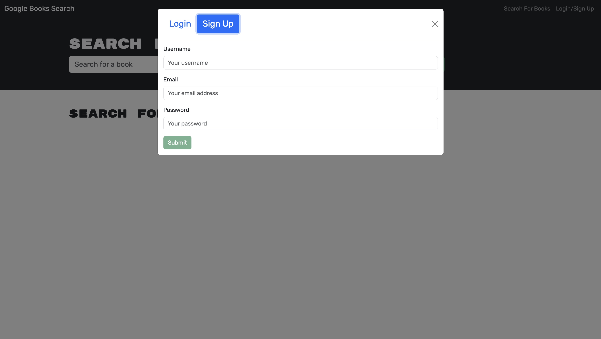
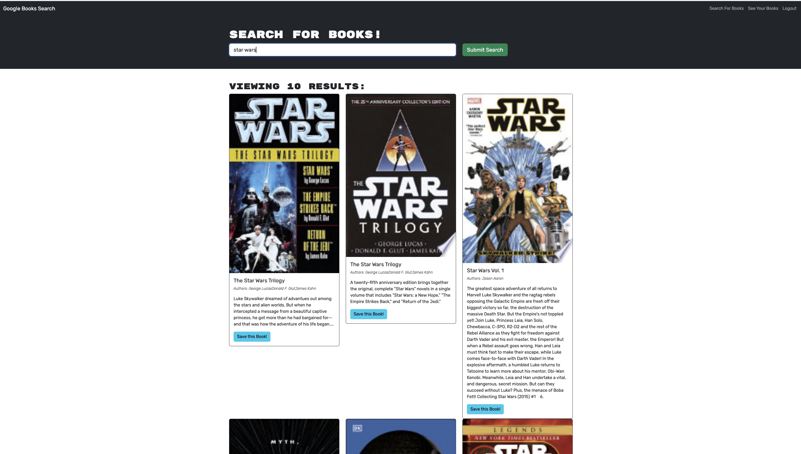
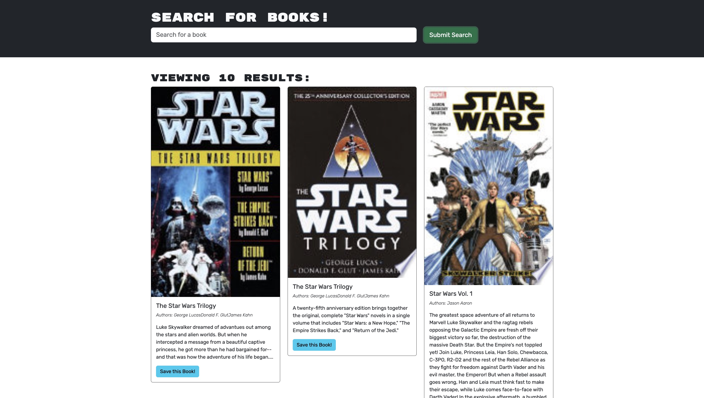
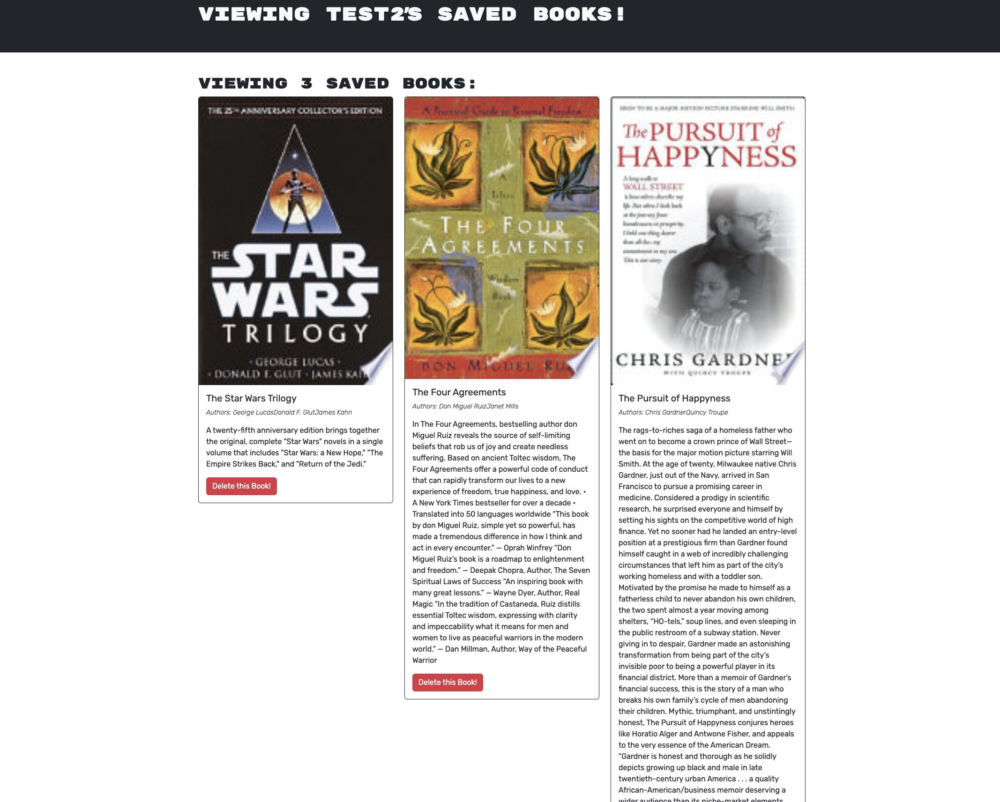

# Book Search Engine

## Description

This is an application that it will make helpful the search for for books using Google Books API where you can save them for later review. The app is built with MongoDB(Atlas) and Graphql for a better management of the data to make it more efficient.

Deployed Application

https://book-search-engine-audp.onrender.com

## Features

- User Authentication
- Book Search
- Save Books
- View Saved Books
- Delete Books

## Usage

### Login Page

Create new account or log in with an existing one.

### Book Search

Find books by entering a search term and then clicking on the Submit Search button.

### Save Books

Click on the Save this Book button to add books on your saved list.

### Delete Books

By going to the page of See Your Books on the the navegation bar, when you see your saved books, you have the option to delete any of them by clicking on the Delete this Book button.

## Technologies Used

- React and Boostrap on the frontend
- Node.js and Express on the backend
- MongoDB(Atlas) for the database
- Google Books API
- Apollo Server & Client to be able to use Graphql

## Question

GitHub: [Nattan Aguia Trujillo](https://github.com/nattanaguiat)

If you have additional questions, please contact me by email at [nattan23@msn.com](nattan23@msn.com)